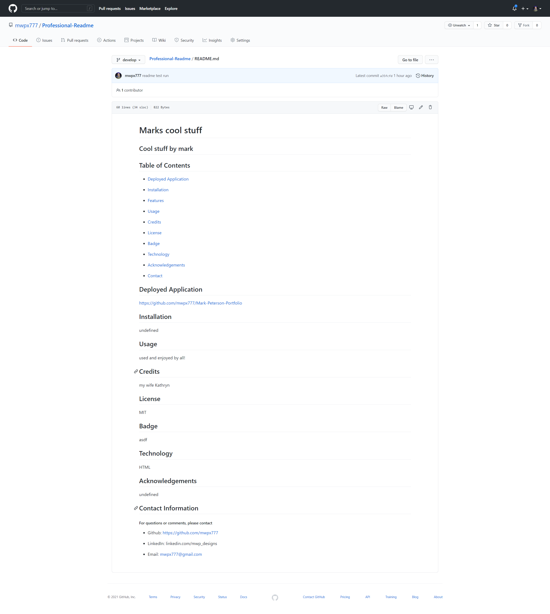

# **Professional-Readme**

## **cool stuff**

## **Table of Contents**

* [Deployed Application](#deployed-application)

* [Screenshot](#screenshot)

* [Installation](#installation)

* [Features](#features)

* [Usage](#usage)

* [Credits](#credits)

* [License](#license)

* [Badge](#badge)

* [Technology](#technology)

* [Acknowledgements](#acknowledgements)

* [Contact](#contact-information)

## **Deployed Application**
https://github.com/mwpx777/Professional-Readme

## **Screenshot**

## **Installation**
undefined

## **Features**
no features

## **Usage**
no usage

## **Credits**
undefined

## **License**
MIT

## **Badge**

https://img.shields.io/github/languages/count/mwpx777/Professional-Readme

## **Technology**
HTML,CSS,Javascript

## **Acknowledgements**
my dogs

## **Contact Information**
##### For questions or comments, please contact

* Github: https://github.com/mwpx777

* LinkedIn: https://www.linkedin.com/in/mwpdesigns/

* Email: mwpx777@gmail.com
